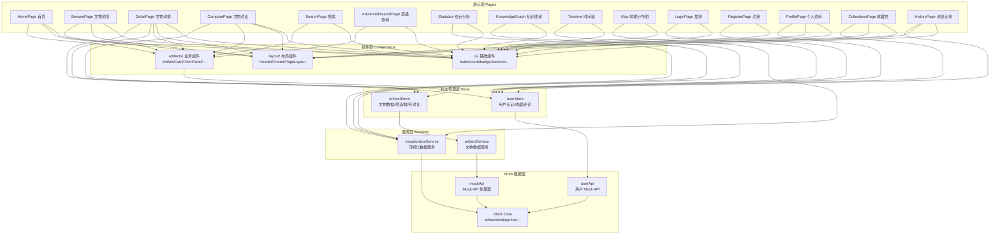
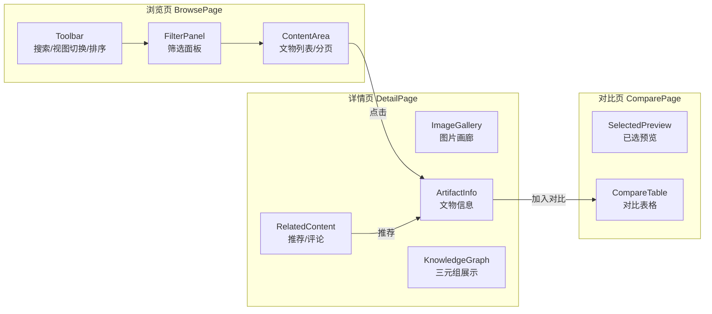
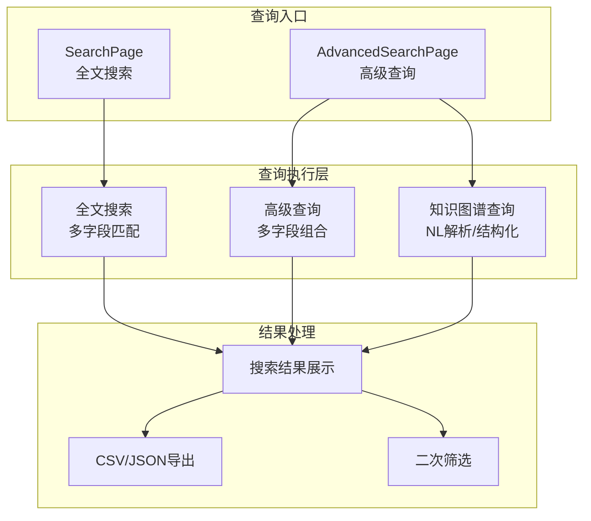
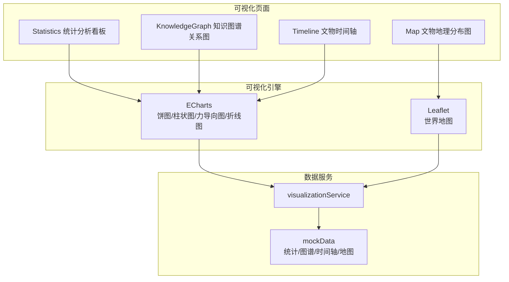
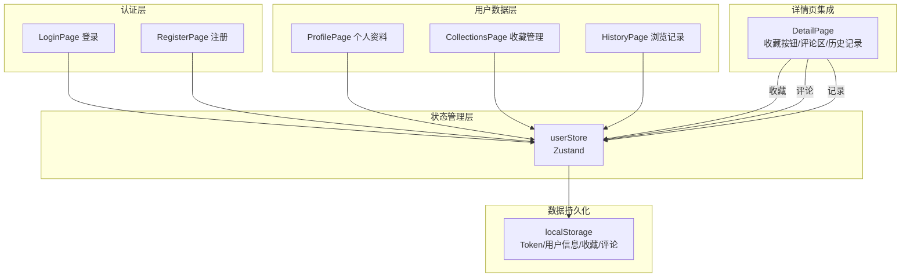

# 海外文物知识服务子系统 - 设计报告

---

## 文档版本记录

| 版本 | 日期 | 作者 | 变更说明 |
|------|------|------|----------|
| v1.0 | 2026-05-15 | 项目组 | 初稿 |

---

## 1. 系统概述

### 1.1 项目背景

"海外文物知识服务子系统"是"海外藏中国文物知识管理与服务平台"的面向用户的 Web 端子系统，为用户提供文物数据的浏览、查询、可视化与个性化服务。系统设计参考大英博物馆、克利夫兰艺术博物馆等国际一流博物馆网站风格。

### 1.2 设计目标

- 提供博物馆级的 UI 用户体验
- 支持多维度文物浏览与搜索
- 实现丰富的知识可视化展示
- 覆盖完整的用户个人信息管理
- 保证类型安全与代码可维护性
- 预留后期对接真实后端接口

### 1.3 架构设计原则

| 原则 | 说明 |
|------|------|
| 单一职责 | 每个组件只做一件事 |
| 接口隔离 | Service 层抽象，实现与接口分离 |
| 状态集中 | 全局状态由 Zustand 统一管理 |
| 类型安全 | TypeScript 严格模式，零 any |
| 可测试性 | 纯函数组件，依赖注入 |
| 渐进增强 | Mock 数据先行，真实 API 后续对接 |

---

## 2. 总体架构设计

### 2.1 系统架构图



### 2.2 系统分层

#### 第一层：页面层（Pages）

15个页面组件，对应15个路由。每个页面负责组合子组件、管理页面级状态、协调数据流。

#### 第二层：组件层（Components）

- **ui/**：shadcn/ui 基础组件（button, card, badge, input, skeleton 等）
- **layout/**：布局组件（Header 导航栏、Footer 页脚、PageLayout 容器）
- **artifacts/**：业务组件（ArtifactCard 卡片、ArtifactListItem 列表项、FilterPanel 筛选面板、SortControl 排序控件）

#### 第三层：状态管理层（Store）

- **artifactStore**：管理文物数据、筛选条件、排序方式、分页状态、对比列表
- **userStore**：管理用户认证、个人资料、浏览记录、收藏、评论

#### 第四层：服务层（Services）

- **artifactService**：封装 IArtifactService 接口，提供文物数据的 CRUD 操作
- **visualizationService**：提供统计分析、知识图谱、时间轴、地图数据的服务

#### 第五层：数据层（Mock Data）

- **mock/handlers.ts**：实现所有 Mock API，包含筛选、排序、分页、推荐算法
- **mock/data/**：静态数据集（artifacts, categories, regions, materials, museums, users）

### 2.3 技术栈选型

| 技术 | 版本 | 选择理由 |
|------|------|----------|
| **React 18** | ^18.3.1 | 函数式组件 + Hooks 范式，生态成熟，适合课程项目 |
| **TypeScript 5** | ~5.5.4 | 严格类型检查，零 any，提升代码质量和可维护性 |
| **Vite 5** | ^5.4.9 | 极速开发体验，HMR 热更新 <200ms，构建速度快 |
| **TailwindCSS 3** | ^3.4.13 | 原子化 CSS，避免样式冲突，配合 shadcn/ui 高效开发 |
| **shadcn/ui** | latest | 高质量可定制组件，非传统 UI 库依赖，源代码可控 |
| **React Router 6** | ^6.26.2 | 嵌套路由支持，参数获取便捷，社区活跃 |
| **Zustand 4** | ^4.5.5 | 轻量级（<1KB），API 简洁无模板代码，无需 Provider 包裹 |
| **Axios 1** | ^1.16.1 | 拦截器、请求取消、转换器完善，后期对接真实 API 的首选 |
| **ECharts 5** | ^6.0.0 | 丰富的图表类型（饼图、柱状图、力导向图），中文文档完善 |
| **react-leaflet** | ^4.2.1 | React 友好的地图组件封装，基于 Leaflet 轻量级地图库 |
| **lucide-react** | ^0.453.0 | 高质量 SVG 图标库，与 TailwindCSS 配合完美 |

---

## 3. 核心模块设计

### 3.1 数据浏览模块

#### 3.1.1 架构设计



#### 3.1.2 数据流

```
用户操作 → BrowsePage
    → artifactStore.setFilter/setSortBy/setViewMode
    → artifactStore.fetchArtifacts()
    → artifactService.getArtifacts(params)
    → mockApi.getArtifacts(params)
    → 筛选/排序/分页处理
    → artifactStore 更新 artifacts/total
    → 组件重渲染
```

#### 3.1.3 核心组件

**ArtifactCard 组件**

```
Props: { artifact: Artifact }
功能: 展示文物卡片（图片、名称、年代、地区、材质、标签）
交互: 点击 → 跳转详情页 | Hover → 阴影加深
响应式: 4列网格（xl）→ 3列（lg）→ 2列（sm）→ 1列
```

**FilterPanel 组件**

```
筛选维度: 地区/文明、文物类型、材质、年代、博物馆
筛选逻辑: AND 组合，已选条件可单独移除
UI 布局: 桌面端左侧固定，移动端隐藏（预留 Drawer 入口）
```

**SortControl 组件**

```
排序字段: name（名称）、era（年代）、region（地区）、dateAdded（更新时间）
排序方向: asc（升序）/ desc（降序）
交互: 下拉菜单选择字段 + 按钮切换方向
```

#### 3.1.4 推荐算法设计

```typescript
// 加权评分算法
const scored = artifacts.map(artifact => {
    let score = 0;
    if (artifact.region === currentArtifact.region) score += 3.0;
    if (artifact.category === currentArtifact.category) score += 2.5;
    if (artifact.material === currentArtifact.material) score += 2.0;
    if (eraMatch(artifact.era, currentArtifact.era)) score += 2.5;
    if (artifact.museum === currentArtifact.museum) score += 1.5;
    const commonTags = artifact.tags.filter(tag => 
        currentArtifact.tags.includes(tag)
    );
    score += commonTags.length * 1.5;
    return { artifact, score };
}).sort((a, b) => b.score - a.score).slice(0, 4);
```

---

### 3.2 数据查询模块

#### 3.2.1 架构设计



#### 3.2.2 搜索实现

**全文搜索**：在文物名称、英文名、描述、标签等全部文本字段中搜索关键字。

**高级查询**：多字段组合查询（AND 逻辑），支持关键词、类型、材质、博物馆、地区5个字段。

**知识图谱查询**：
- 自然语言模式：解析用户输入中的实体关键词（材质、朝代、地区、博物馆），返回匹配结果
- 结构化模式：按实体类型（material/region/category/artifact）和实体名称查询

#### 3.2.3 结果导出

导出字段：全部 Artifact 属性
格式选项：CSV（UTF-8 编码）/ JSON

---

### 3.3 数据可视化模块

#### 3.3.1 架构设计



#### 3.3.2 统计分析看板

| 模块 | 图表类型 | 数据来源 | 交互功能 |
|------|----------|----------|----------|
| 总览卡片 | 数值展示 | visualizationService | — |
| 类型占比 | 饼图 | typeDistribution | Hover 显示详情 |
| 博物馆排行 | 饼图 | museumDistribution | Hover 显示详情 |
| 朝代分布 | 柱状图 | dynastyDistribution | Hover 显示详情 |

#### 3.3.3 知识图谱关系图

- 力导向图布局（ECharts graph）
- 节点类型：文物、博物馆、朝代、艺术家、地点、类型、材质
- 节点大小：按类型区分（文物 50，博物馆 40，朝代/艺术家 35，其他 30）
- 交互：拖拽、缩放、悬停显示属性、点击显示详情

#### 3.3.4 文物时间轴

- 双视图切换：折线图 / 柱状图
- 筛选：朝代下拉筛选 + 自定义年份范围
- 交互：点击数据点跳转文物列表
- 底部表格：展示朝代详细信息（起止年份、文物数量）

#### 3.3.5 文物地理分布图

- 地图引擎：Leaflet + OpenStreetMap
- 标记类型：圆形标记（大小代表藏品数量）
- 交互：点击标记 → 弹窗展示博物馆详情（名称、城市、藏品数）
- 右侧面板：统计摘要 + 博物馆列表（点击高亮地图标记）

---

### 3.4 用户个人信息管理模块

#### 3.4.1 架构设计



#### 3.4.2 用户认证流程

```
注册: 填写表单 → 前端验证 → userApi.register() → 生成Token → 保存到localStorage → 自动登录
登录: 输入凭据 → userApi.login() → 验证密码 → 返回Token → 保存到localStorage → 跳转首页
登出: 清除Token → 清除用户数据 → 跳转首页
状态保持: 页面初始化时从localStorage读取Token → 恢复登录状态
```

#### 3.4.3 数据持久化策略

| 数据类型 | 存储位置 | 存储时机 | 恢复时机 |
|----------|----------|----------|----------|
| 登录 Token | localStorage | 登录成功 | 页面初始化 |
| 用户信息 | localStorage | 登录/资料更新 | 页面初始化 |
| 浏览记录 | localStorage | 每次访问详情页 | userStore 初始化 |
| 收藏数据 | localStorage | 每次收藏操作 | userStore 初始化 |
| 评论数据 | localStorage | 每次评论操作 | 详情页加载 |

#### 3.4.4 评论系统设计

```
数据结构: Map<artifactId, Comment[]>
每条评论: { id, artifactId, userId, username, content, likes, likedBy, replies[], createdAt }
回复: { id, commentId, userId, username, content, createdAt }
交互: 发表评论 → 评论列表刷新 → 可回复/点赞
```

---

## 4. 数据库设计

### 4.1 当前阶段（Mock 数据）

开发阶段使用内存数据 + localStorage 存储，无需真实数据库。

| 数据类别 | 存储方式 | 生命周期 |
|----------|----------|----------|
| 文物数据 | 内存数组（`mock/data/artifacts.ts`） | 页面刷新重建 |
| 筛选选项 | 内存数组（`regions.ts, categories.ts` 等） | 页面刷新重建 |
| 用户数据 | 内存 Map（`handlers.ts`）+ localStorage | 持久化 |
| 收藏数据 | 内存 Map + localStorage | 持久化 |
| 浏览记录 | 内存 Map + localStorage | 持久化 |
| 评论数据 | 内存数组 + localStorage | 持久化 |

### 4.2 后期对接（图数据库 + 关系型数据库）

当与知识图谱构建子系统对接后，采用双层存储架构：

| 数据库 | 存储内容 | 查询用途 |
|--------|----------|----------|
| Neo4j（图数据库） | 知识图谱三元组 | 关系查询、SPARQL 检索 |
| MySQL（关系型数据库） | 文物详情、用户数据、业务数据 | 结构化查询、用户管理 |

---

## 5. 状态管理设计

### 5.1 artifactStore

```typescript
// 状态结构
interface ArtifactStore {
  // 数据
  artifacts: Artifact[];           // 当前页文物列表
  currentArtifact: Artifact | null; // 当前查看的文物
  recommendations: Artifact[];     // 推荐列表
  total: number;                   // 总记录数

  // UI 状态
  viewMode: 'card' | 'list';      // 视图模式
  sortBy: SortOption;              // 排序字段
  sortOrder: 'asc' | 'desc';      // 排序方向
  currentPage: number;             // 当前页码
  pageSize: number;                // 每页数量
  searchQuery: string;             // 搜索关键字

  // 筛选状态
  filters: FilterState;            // { region, category, material, era, museum, search }

  // 对比状态
  compareList: Artifact[];         // 对比列表（最多3件）
}
```

### 5.2 userStore

```typescript
// 状态结构
interface UserStore {
  // 认证
  currentUser: UserProfile | null;
  token: string | null;
  isAuthenticated: boolean;

  // 用户数据
  browseHistory: BrowseHistory[];         // 浏览记录
  collectionGroups: CollectionGroup[];    // 收藏分组
  collectionItems: CollectionItem[];      // 收藏项
  comments: Record<string, Comment[]>;    // 评论
}
```

### 5.3 数据流模式

```
Component → Store Action → Service → Mock API → Response → Store State → Component Re-render
```

---

## 6. 路由设计

### 6.1 路由配置

```typescript
// 嵌套路由结构
createBrowserRouter([
  {
    path: '/',
    element: <PageLayout />,  // 统一布局
    children: [
      // 首页
      { index: true, element: <HomePage /> },

      // 数据浏览
      { path: 'browse',        element: <BrowsePage /> },
      { path: 'artifact/:id',  element: <DetailPage /> },
      { path: 'compare',       element: <ComparePage /> },

      // 数据查询
      { path: 'search',          element: <SearchPage /> },
      { path: 'advanced-search', element: <AdvancedSearchPage /> },

      // 数据可视化
      { path: 'statistics',     element: <Statistics /> },
      { path: 'knowledge-graph', element: <KnowledgeGraph /> },
      { path: 'timeline',       element: <Timeline /> },
      { path: 'map',            element: <Map /> },

      // 用户管理
      { path: 'login',    element: <LoginPage /> },
      { path: 'register', element: <RegisterPage /> },
      { path: 'profile',  element: <ProfilePage /> },
      { path: 'collections', element: <CollectionsPage /> },
      { path: 'history',  element: <HistoryPage /> },
    ],
  },
]);
```

### 6.2 路由关系图

```mermaid
graph TB
    ROOT[/PageLayout] --> HOME[首页 /]
    ROOT --> BROWSE[文物浏览 /browse]
    ROOT --> DETAIL[文物详情 /artifact/:id]
    ROOT --> COMPARE[文物对比 /compare]
    ROOT --> SEARCH[全文搜索 /search]
    ROOT --> ADV[高级查询 /advanced-search]
    ROOT --> STAT[统计分析 /statistics]
    ROOT --> KG[知识图谱 /knowledge-graph]
    ROOT --> TL[时间轴 /timeline]
    ROOT --> MAP[地理分布 /map]
    ROOT --> LOGIN[登录 /login]
    ROOT --> REG[注册 /register]
    ROOT --> PROFILE[个人资料 /profile]
    ROOT --> COLL[收藏夹 /collections]
    ROOT --> HIST[浏览记录 /history]

    BROWSE -->|点击文物| DETAIL
    BROWSE -->|加入对比| COMPARE
    DETAIL -->|加入对比| COMPARE
    DETAIL -->|收藏| COLL
    DETAIL -->|浏览| HIST
    TL -->|点击朝代| BROWSE
```

---

## 7. 错误处理与边界情况

### 7.1 全局错误处理

```typescript
// 所有 async 操作使用 try-catch
try {
    set({ loading: true, error: null });
    const response = await mockApi.getArtifacts(params);
    set({ artifacts: response.data, loading: false });
} catch (error) {
    set({ error: '加载文物数据失败', loading: false });
    console.error('Failed to fetch artifacts:', error);
}
```

### 7.2 边界情况处理

| 场景 | 处理方式 | 展示组件 |
|------|----------|----------|
| 数据加载中 | 骨架屏 Skeleton 动画 | loading-skeleton.tsx |
| 数据为空 | 空状态提示 + 引导操作 | empty-state.tsx |
| 数据加载失败 | 错误信息 + 重试操作 | error-state.tsx |
| 图片加载失败 | 占位图标（Gem 图标） | ArtifactCard 内置 |
| 详情页 ID 无效 | "文物未找到"提示 | DetailPage 内置 |
| 未登录操作 | 提示登录 + 跳转登录页 | 各页面 |
| 筛选无结果 | 空状态 + 重置建议 | BrowsePage 内置 |
| 对比列表满 | 阻止添加（上限3件） | artifactStore.isInCompare |

---

## 8. UI 设计规范

### 8.1 设计参考

主参考：大英博物馆官网（https://www.britishmuseum.org/）
风格定位：博物馆级、学术感、优雅、专业

### 8.2 色彩方案

| 用途 | 色值 | CSS 变量 |
|------|------|----------|
| 主色（深色） | `#1a1a1a` | `--museum-dark` |
| 次级深色 | `#2d2d2d` | `--museum-darker` |
| 米白背景 | `#f5f5f0` | `--museum-cream` |
| 浅米白 | `#fafaf8` | `--museum-cream-light` |
| 金色强调 | `#c9a961` | `--museum-gold` |
| 金色深版 | `#b8860b` | `--museum-gold-dark` |
| 文字深灰 | `#333333` | — |
| 边框浅灰 | `#e5e5e5` | — |

### 8.3 布局规范

| 规范 | 值 |
|------|-----|
| 页面最大宽度 | 1280px（container） |
| 留白间距 | padding/margin ≥ 16px |
| 卡片圆角 | rounded-lg（8px） |
| 默认阴影 | shadow-md，hover 时 shadow-lg |
| 过渡动画 | transition-all duration-300 |

### 8.4 字体层级

| 层级 | 样式 | 用途 |
|------|------|------|
| 一级标题 | text-3xl md:text-4xl font-bold | 页面主标题 |
| 二级标题 | text-2xl font-bold | 区块标题 |
| 三级标题 | text-xl font-semibold | 卡片标题 |
| 正文 | text-base | 描述文本 |
| 辅助文字 | text-sm text-gray-500 | 提示信息 |

### 8.5 响应式断点

| 断点 | 宽度 | 布局调整 |
|------|------|----------|
| sm | ≥640px | 卡片网格2列 |
| md | ≥768px | 平板上 |
| lg | ≥1024px | 显示侧边栏筛选，卡片3列 |
| xl | ≥1280px | 卡片4列 |

---

## 9. Mock 数据设计

### 9.1 数据规模

| 数据类型 | 数量 | 特点 |
|----------|------|------|
| 文物主数据 | 12条 | 真实世界著名文物，不规则字段分布 |
| 分类数据 | 12个 | 石雕铭文、雕塑、陶塑等 |
| 地区数据 | 12个 | 古埃及、古希腊、中国古代等文明圈 |
| 材质数据 | 14种 | 花岗闪长岩、黄金、青铜、陶瓷等 |
| 博物馆数据 | 10个 | 大英博物馆、卢浮宫等世界顶级博物馆 |
| 用户数据 | 2个预设用户 | 管理员和普通用户各一 |

### 9.2 数据真实性增强

- 不规则字段缺失（部分文物缺少 nameEn、location、depth）
- 多样化描述长度（30字~100+字）
- 不同年代格式（公元前、朝代、时间范围）
- 单图/多图/无图文物混合
- 博物馆名称格式多样（中文、英文、混合）

### 9.3 推荐算法验证数据

每条文物数据包含 3-6 个标签，标签交叉设计用于验证推荐算法的多维度匹配：

- 同地区标签：如 `['埃及', '法老', '考古学']`
- 同类型标签：如 `['雕塑', '人体', '艺术']`
- 关联标签：如 `['埃及', '雕塑']` 用于跨维度匹配

---

## 10. 后期对接方案

### 10.1 对接策略

采用 Adapter 模式，通过 Service 层抽象隔离 Mock 和真实 API：

```typescript
// 开发环境使用 Mock
const isDev = import.meta.env.DEV;

class ArtifactService {
    async getArtifacts(params) {
        if (isDev) {
            return mockApi.getArtifacts(params);
        }
        // 后期替换为真实 API
        const response = await apiClient.get('/artifacts', { params });
        return response.data;
    }
}
```

### 10.2 环境变量配置

```env
# .env.development
VITE_USE_MOCK=true

# .env.production
VITE_API_BASE_URL=https://api.your-backend.com
VITE_USE_MOCK=false
```

### 10.3 对接步骤

1. 配置环境变量（VITE_API_BASE_URL, VITE_USE_MOCK）
2. 创建真实 API 适配器（调用 axios 请求）
3. 确保后端响应结构与 TypeScript 类型定义一致
4. 统一错误处理机制
5. 移除 Mock 延迟模拟

### 10.4 预定义 API 接口规范

```typescript
// 后端需实现的 RESTful API

GET  /api/artifacts?region=...&category=...&page=1&size=12&sort=name
  → { data: Artifact[], total: number, page: number, size: number }

GET  /api/artifacts/:id
  → Artifact

GET  /api/artifacts/:id/recommendations?limit=4
  → Artifact[]

GET  /api/filters/options
  → { regions: Option[], categories: Option[], materials: Option[], eras: Option[], museums: Option[] }

POST /api/auth/login
  → { token: string, user: UserProfile }

POST /api/auth/register
  → { token: string, user: UserProfile }

GET  /api/users/:id/profile
  → UserProfile

PUT  /api/users/:id/profile
  → UserProfile
```

---

## 11. 安全设计

### 11.1 前端安全

| 安全措施 | 实现方式 |
|----------|----------|
| 密码哈希 | 使用 simpleHash 函数存储密码哈希值 |
| Token 管理 | 登录 Token 存储于 localStorage |
| 输入验证 | 前端对输入进行合法性检查（用户名长度、密码强度） |
| 敏感信息 | 密码不在前端明文存储或展示 |

### 11.2 数据安全

| 数据类型 | 安全措施 |
|----------|----------|
| 用户密码 | 哈希后存储 |
| 浏览记录 | 仅保存于 localStorage |
| 收藏数据 | 仅保存于 localStorage |

---

## 12. 性能优化设计

| 优化点 | 方案 | 状态 |
|--------|------|------|
| 图片加载 | loading='lazy' 延迟加载 | ✅ 已实现 |
| 加载体验 | 骨架屏 Skeleton 动画 | ✅ 已实现 |
| 状态更新 | Zustand 选择性订阅避免不必要的重渲染 | ✅ 已实现 |
| 响应式图片 | 使用百分比/相对单位 | ✅ 已实现 |
| CSS 优化 | TailwindCSS + PurgeCSS 移除未用样式 | ✅ 已实现 |
| 代码分割 | 预留 React.lazy() + Suspense 入口 | ⬜ 待优化 |
| 虚拟滚动 | 预留 @tanstack/react-virtual 接口 | ⬜ 待优化 |
| 生产构建 | Vite 自动代码分割和压缩 | ✅ 已实现 |

---

## 13. 项目文件结构

```
knowledge-service-web-main/
├── src/
│   ├── App.tsx                          # 应用入口
│   ├── main.tsx                         # 渲染入口
│   ├── router.tsx                       # 路由配置（15条路由）
│   ├── index.css                        # TailwindCSS 全局样式
│   │
│   ├── components/
│   │   ├── ui/                          # shadcn/ui 基础组件
│   │   │   ├── badge.tsx
│   │   │   ├── button.tsx
│   │   │   ├── card.tsx
│   │   │   ├── empty-state.tsx
│   │   │   ├── error-state.tsx
│   │   │   ├── input.tsx
│   │   │   ├── loading-skeleton.tsx
│   │   │   └── skeleton.tsx
│   │   ├── layout/                      # 布局组件
│   │   │   ├── Header.tsx
│   │   │   ├── Footer.tsx
│   │   │   └── PageLayout.tsx
│   │   └── artifacts/                   # 业务组件
│   │       ├── ArtifactCard.tsx
│   │       ├── ArtifactListItem.tsx
│   │       ├── FilterPanel.tsx
│   │       └── SortControl.tsx
│   │
│   ├── pages/                           # 页面组件
│   │   ├── HomePage.tsx                 # 首页
│   │   ├── BrowsePage.tsx               # 文物浏览
│   │   ├── DetailPage.tsx               # 文物详情
│   │   ├── ComparePage.tsx              # 文物对比
│   │   ├── SearchPage.tsx               # 全文搜索
│   │   ├── AdvancedSearchPage.tsx       # 高级查询
│   │   ├── Statistics.tsx               # 统计分析
│   │   ├── KnowledgeGraph.tsx           # 知识图谱
│   │   ├── Timeline.tsx                 # 时间轴
│   │   ├── Map.tsx                      # 地理分布
│   │   ├── LoginPage.tsx                # 登录
│   │   ├── RegisterPage.tsx             # 注册
│   │   ├── ProfilePage.tsx              # 个人资料
│   │   ├── CollectionsPage.tsx          # 收藏夹
│   │   └── HistoryPage.tsx              # 浏览记录
│   │
│   ├── services/                        # 服务层
│   │   ├── artifactService.ts           # 文物数据服务
│   │   └── visualizationService.ts      # 可视化数据服务
│   │
│   ├── store/                           # 状态管理
│   │   ├── artifactStore.ts             # 文物 State + Actions
│   │   └── userStore.ts                 # 用户 State + Actions
│   │
│   ├── mock/                            # Mock 数据层
│   │   ├── handlers.ts                  # Mock API 处理器
│   │   └── data/
│   │       ├── artifacts.ts             # 文物数据（12条）
│   │       ├── categories.ts            # 分类数据（12个）
│   │       ├── regions.ts               # 地区数据（12个）
│   │       ├── materials.ts             # 材质数据（14种）
│   │       ├── museums.ts               # 博物馆数据（10个）
│   │       └── users.ts                 # 用户数据（预设）
│   │
│   ├── types/                           # 类型定义
│   │   ├── artifact.ts                  # 文物/筛选/分页类型
│   │   ├── filter.ts                    # UI 筛选类型
│   │   └── user.ts                      # 用户/收藏/评论类型
│   │
│   └── lib/                             # 工具库
│       └── utils.ts                     # cn() 类名合并工具
│
├── docs/
│   └── tech-design.md                   # 技术设计文档
│
├── plans/                               # 项目文档
│   ├── 项目管理计划.md
│   ├── 需求规格说明书.md
│   └── 设计报告.md
│
├── AGENTS.md                            # AI 开发规范
├── README.md                            # 项目说明
├── package.json                         # 依赖配置
└── vite.config.ts                       # Vite 构建配置
```

---

## 14. 附录

### 14.1 开发命令

```bash
# 启动开发服务器
npm run dev

# 生产构建
npm run build

# 类型检查
npm run typecheck

# 生产构建预览
npm run preview
```

### 14.2 关键依赖清单

```json
{
  "react": "^18.3.1",
  "react-dom": "^18.3.1",
  "react-router-dom": "^6.26.2",
  "zustand": "^4.5.5",
  "axios": "^1.16.1",
  "tailwindcss": "^3.4.13",
  "typescript": "~5.5.4",
  "vite": "^5.4.9",
  "echarts": "^6.0.0",
  "echarts-for-react": "^3.0.6",
  "leaflet": "^1.9.4",
  "react-leaflet": "^4.2.1",
  "lucide-react": "^0.453.0"
}
```

### 14.3 代码统计

| 类别 | 文件数 | 估计代码行数 |
|------|--------|-------------|
| 页面组件 | 15个 | ~3,500 行 |
| UI 组件 | 8个 | ~400 行 |
| 业务组件 | 4个 | ~600 行 |
| 布局组件 | 3个 | ~200 行 |
| Store | 2个 | ~800 行 |
| Services | 2个 | ~200 行 |
| Mock 数据 | 7个 | ~1,000 行 |
| 类型定义 | 3个 | ~200 行 |
| 配置文件 | 6个 | ~200 行 |
| **合计** | **~50个** | **~7,100 行** |

### 14.4 参考资料

- [React 官方文档](https://react.dev/)
- [TypeScript 官方文档](https://www.typescriptlang.org/)
- [Vite 官方文档](https://vitejs.dev/)
- [TailwindCSS 官方文档](https://tailwindcss.com/docs)
- [shadcn/ui 组件库](https://ui.shadcn.com/)
- [Zustand 文档](https://zustand-demo.pmnd.rs/)
- [React Router v6 文档](https://reactrouter.com/)
- [ECharts 官方文档](https://echarts.apache.org/zh/index.html)
- [Leaflet 官方文档](https://leafletjs.com/)
- 大英博物馆官网（UI/UX 设计参考）

---
