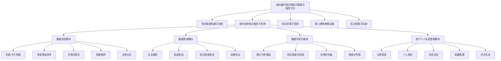

# 海外文物知识服务子系统 - 需求规格说明书

---

## 文档版本记录

| 版本 | 日期 | 作者 | 变更说明 |
|------|------|------|----------|
| v1.0 | 2026-05-15 | 项目组 | 初稿 |

---

## 1. 引言

### 1.1 目的

本文档旨在明确"海外文物知识服务子系统"的功能需求与非功能需求，为系统设计、开发实现与验收测试提供依据。本文档的目标读者包括项目组成员、课程指导教师及评审人员。

### 1.2 范围

本文档涵盖海外文物知识服务子系统 Web 端的所有功能需求，包括：

- 数据浏览功能
- 数据查询功能
- 数据可视化功能
- 用户个人信息管理功能
- 系统非功能性需求

### 1.3 定义与缩写

| 术语 | 说明 |
|------|------|
| 文物（Artifact） | 海外博物馆收藏的中国文物 |
| 三元组（Triple） | 知识图谱的基本单元，格式为（主体-谓词-客体） |
| Mock Data | 模拟数据，用于开发阶段替代真实后端 |
| SPA | 单页应用（Single Page Application） |
| SRS | 软件需求规格说明书（Software Requirements Specification） |

---

## 2. 系统概述

### 2.1 系统背景

"海外藏中国文物知识管理与服务平台"是一个综合性的软件系统，包含五个子系统。海外文物知识服务子系统是该平台的 Web 端面向用户的子系统，旨在为用户提供专业、优雅的文物知识浏览、查询与可视化服务。

### 2.2 系统定位



### 2.3 用户特征

| 用户类型 | 特征 | 使用场景 |
|----------|------|----------|
| 普通访客 | 未登录用户 | 浏览文物、搜索、查看详情、对比 |
| 注册用户 | 已登录用户 | 收藏、评论、浏览记录、个性化推荐 |
| 研究人员 | 专业用户 | 高级搜索、数据导出、知识图谱分析 |
| 管理员 | 后台管理（本系统不含） | — |

---

## 3. 功能需求

### 3.1 数据浏览模块

#### FR-1 多视图文物列表

**描述**：系统应提供卡片视图和列表视图两种文物展示方式，用户可自由切换。

**前置条件**：用户访问 `/browse` 页面。

**正常流程**：
1. 系统从数据源获取文物数据列表
2. 默认以卡片视图展示（4列网格布局）
3. 用户可点击工具栏的 Grid/List 图标切换视图模式
4. 切换后保持当前筛选和排序状态

**备选流程**：
- 数据加载中：显示骨架屏 Loading 动画
- 无数据：显示空状态提示
- 数据加载失败：显示错误提示

**验收标准**：
- [ ] 卡片视图：大图展示，4列响应式网格（1→2→3→4列）
- [ ] 列表视图：左侧缩略图 + 右侧详细信息
- [ ] 视图切换动画平滑
- [ ] 切换后不丢失筛选/分页状态

#### FR-2 多维筛选

**描述**：系统应支持按地区/文明、文物类型、材质、年代、博物馆5个维度进行组合筛选。

**前置条件**：用户位于 `/browse` 页面。

**正常流程**：
1. 左侧筛选面板展示5个筛选维度
2. 每个维度以列表形式展示可选项及对应数量
3. 用户点击某个选项，筛选生效
4. 已选条件在面板顶部展示（可单独移除）
5. 多个筛选项可叠加（AND 逻辑）
6. 提供"重置筛选"按钮一键清除所有筛选

**验收标准**：
- [ ] 5个筛选维度均可独立选择
- [ ] 组合筛选结果正确（AND 逻辑）
- [ ] 筛选后结果数量实时更新
- [ ] 已选条件显示一目了然
- [ ] 桌面端左侧固定显示，移动端适配

#### FR-3 智能排序

**描述**：系统应支持按名称、年代、地区、更新时间进行排序。

**前置条件**：用户位于 `/browse` 页面。

**正常流程**：
1. 工具栏提供排序下拉菜单
2. 用户选择排序字段（名称/年代/地区/更新时间）
3. 用户可点击升序/降序切换按钮
4. 排序后列表立即重新排列

**验收标准**：
- [ ] 4种排序方式可用
- [ ] 升序/降序切换正确
- [ ] 排序后分页数据重新计算

#### FR-4 分页浏览

**描述**：系统应支持分页展示文物数据。

**前置条件**：用户位于 `/browse` 页面。

**正常流程**：
1. 页面底部展示分页器
2. 每页默认展示12条数据
3. 用户可点击页码跳转
4. 提供上一页/下一页按钮

**验收标准**：
- [ ] 分页导航完整可用
- [ ] 切换筛选/排序后重置到第一页
- [ ] 页码显示合理（当总页数>7时智能折叠）

#### FR-5 文物详情页

**描述**：系统应提供完整的文物详情展示页面。

**前置条件**：用户点击文物卡片/列表项，访问 `/artifact/:id`。

**正常流程**：
1. 左侧展示文物高清图片（支持点击全屏放大）
2. 右侧展示文物基础信息（名称、英文名、年代、地区、材质、尺寸）
3. 展示详细描述和历史背景文本
4. 展示知识图谱三元组关系
5. 展示标签列表
6. 底部展示"相关文物推荐"
7. 支持收藏、加入对比、分享操作
8. 支持评论互动

**验收标准**：
- [ ] 图片点击全屏放大（Lightbox 效果）
- [ ] 多图缩略图切换
- [ ] 三元组关系彩色编码展示
- [ ] 推荐算法基于多维度加权评分
- [ ] 收藏/对比按钮与全局状态联动

#### FR-6 相关文物推荐

**描述**：系统在详情页底部展示与当前文物相关的4件文物。

**前置条件**：用户访问文物详情页。

**正常流程**：
1. 系统基于加权评分算法计算相似度
2. 展示评分最高的4件文物
3. 标注推荐依据（同朝代、同材质等）

**加权算法**：
| 维度 | 权重 |
|------|------|
| 同地区/文明 | 3.0 |
| 同朝代/年代 | 2.5 |
| 同类别/类型 | 2.5 |
| 同材质 | 2.0 |
| 同博物馆 | 1.5 |
| 同标签（每个） | 1.5 |

**验收标准**：
- [ ] 推荐结果相关度合理
- [ ] 推荐依据明确标注
- [ ] 点击推荐文物跳转到对应详情页

#### FR-7 文物对比

**描述**：系统应支持用户选择2-3件文物进行横向属性对比。

**前置条件**：用户至少有2件文物已加入对比列表。

**正常流程**：
1. 用户可在浏览页列表视图或详情页将文物加入对比
2. 对比列表最多支持3件文物
3. 访问 `/compare` 页面查看对比表格
4. 表格属性行包含：名称、年代、地区、类型、材质、尺寸、博物馆、描述、标签
5. 差异值以金色高亮显示，相同值灰色淡化
6. 支持单个移除和清空所有对比项

**验收标准**：
- [ ] 对比列表上限3件
- [ ] 已选预览区正确展示
- [ ] 对比表格属性完整
- [ ] 差异值高亮正确
- [ ] 空状态引导完善

---

### 3.2 数据查询模块

#### FR-8 全文搜索

**描述**：系统应支持按文物名称、博物馆名称、年代等关键字进行全文检索。

**前置条件**：用户访问 `/search` 页面。

**正常流程**：
1. 用户输入搜索关键字
2. 系统在文物名称、英文名、描述、标签等多个字段中搜索
3. 结果页展示匹配的文物卡片
4. 支持按博物馆、地区、类型进行二次筛选
5. 支持保存搜索历史到 localStorage

**验收标准**：
- [ ] 搜索响应及时（Mock 环境<500ms）
- [ ] 搜索结果相关度高
- [ ] 二次筛选功能正常
- [ ] 搜索历史可查看和清除
- [ ] 支持导出搜索结果

#### FR-9 高级查询

**描述**：系统应支持对文物类型、年代范围、材质、收藏地等字段进行组合限定查询。

**前置条件**：用户访问 `/advanced-search` 页面。

**正常流程**：
1. 展示多字段查询表单（关键词、文物类型、材质、博物馆、地区）
2. 用户填写一个或多个查询条件
3. 点击"搜索"按钮执行查询
4. 结果以卡片网格展示
5. 支持重置所有条件

**验收标准**：
- [ ] 至少5个查询字段可用
- [ ] 组合查询逻辑正确（AND 逻辑）
- [ ] 空条件自动忽略
- [ ] 支持导出查询结果

#### FR-10 知识图谱查询

**描述**：系统应支持用户以自然语言或结构化方式查询实体间的关系。

**前置条件**：用户访问查询页面。

**正常流程**：
1. **自然语言查询**：用户输入如"查询某朝代的所有瓷器"或"查询某位艺术家的全部作品"
2. 系统解析自然语言，识别实体类型和查询意图
3. 返回匹配的文物结果及关系数据
4. **结构化查询**：用户选择实体类型（材质/地区/类型等）和实体名称
5. 系统返回该实体的关联文物

**验收标准**：
- [ ] 自然语言查询支持材质、朝代、地区、博物馆等实体匹配
- [ ] 结构化查询至少支持4种实体类型（材质、地区、类别、文物）
- [ ] 查询结果附带关系数据
- [ ] 无法解析时返回提示信息

#### FR-11 查询结果导出

**描述**：系统应支持将查询结果导出为 CSV 或 JSON 格式。

**前置条件**：搜索或查询后有结果数据。

**正常流程**：
1. 用户点击"导出 CSV"或"导出 JSON"按钮
2. 系统生成对应格式文件
3. 文件自动下载到本地

**验收标准**：
- [ ] CSV 格式正确（UTF-8 编码，Excel 可打开）
- [ ] JSON 格式正确（符合 Artifact 类型定义）
- [ ] 导出文件包含文物完整信息

---

### 3.3 数据可视化模块

#### FR-12 统计分析看板

**描述**：系统应以图表形式展示文物统计数据。

**前置条件**：用户访问 `/statistics` 页面。

**正常流程**：
1. 展示顶部总览卡片（文物总数、博物馆数量、文物类型数、历史朝代数）
2. 文物类型占比饼图
3. 博物馆藏量排行饼图
4. 各朝代文物数量分布柱状图

**验收标准**：
- [ ] 图表使用 ECharts 渲染
- [ ] 总览数据正确
- [ ] 图表交互正常（hover 显示详情）
- [ ] 响应式适配

#### FR-13 知识图谱关系图

**描述**：系统应采用力导向图展示文物实体及其关联关系。

**前置条件**：用户访问 `/knowledge-graph` 页面。

**正常流程**：
1. 展示力导向图，节点为文物、博物馆、朝代、艺术家等实体
2. 边为实体间的关系（收藏于、创作于、类型为等）
3. 支持节点拖拽、缩放
4. 悬停显示节点名称和类型
5. 点击节点在右侧显示详情面板

**验收标准**：
- [ ] 力导向图正确渲染
- [ ] 节点拖拽和缩放流畅
- [ ] 悬停信息显示正确
- [ ] 点击节点展示详情

#### FR-14 文物时间轴

**描述**：系统应以时间轴形式展示各历史时期的文物分布。

**前置条件**：用户访问 `/timeline` 页面。

**正常流程**：
1. 折线图/柱状图双视图切换
2. 支持按朝代下拉筛选
3. 支持自定义年份范围筛选
4. 点击数据点跳转到对应朝代的文物列表
5. 底部表格展示朝代详细信息

**验收标准**：
- [ ] 双视图切换正常
- [ ] 朝代筛选和年份筛选正确联动
- [ ] 点击数据点跳转功能正常

#### FR-15 文物地理分布图

**描述**：系统应以世界地图形式展示博物馆地理位置。

**前置条件**：用户访问 `/map` 页面。

**正常流程**：
1. 基于 Leaflet + OpenStreetMap 的世界地图
2. 红色标记展示博物馆地理位置
3. 圆圈大小代表藏品数量
4. 点击标记弹出博物馆详情弹窗
5. 右侧统计摘要和博物馆列表联动

**验收标准**：
- [ ] 地图正确加载
- [ ] 博物馆标记位置准确
- [ ] 点击标记弹出详情
- [ ] 列表点击高亮对应标记

---

### 3.4 用户个人信息管理模块

#### FR-16 用户注册

**描述**：新用户可通过系统注册账号。

**前置条件**：用户访问 `/register` 页面。

**正常流程**：
1. 用户填写用户名、邮箱、密码、昵称
2. 系统验证输入合法性（用户名长度3-20，密码≥6位）
3. 检查用户名和邮箱是否已存在
4. 注册成功后自动登录并跳转首页

**验收标准**：
- [ ] 输入验证规则正确
- [ ] 重复用户名/邮箱检测
- [ ] 注册成功后自动登录

#### FR-17 用户登录

**描述**：注册用户可通过用户名或邮箱登录。

**前置条件**：用户访问 `/login` 页面。

**正常流程**：
1. 用户输入用户名/邮箱和密码
2. 系统验证凭据
3. 登录成功后保存 Token 到 localStorage
4. 跳转至首页或前一个页面

**验收标准**：
- [ ] 用户名/邮箱均可登录
- [ ] 密码验证正确
- [ ] Token 持久化
- [ ] 登录状态刷新后保持

#### FR-18 个人资料管理

**描述**：用户可查看和编辑个人资料。

**前置条件**：用户已登录，访问 `/profile` 页面。

**正常流程**：
1. 展示当前用户信息（用户名、邮箱、昵称、个人简介）
2. 支持编辑昵称、个人简介
3. 支持修改头像
4. 支持修改密码
5. 修改后保存到 localStorage

**验收标准**：
- [ ] 个人信息展示完整
- [ ] 编辑功能可用
- [ ] 修改密码功能可用
- [ ] 数据修改后持久化

#### FR-19 浏览记录

**描述**：系统自动记录用户最近浏览的文物。

**前置条件**：用户已登录，访问文物详情页。

**正常流程**：
1. 用户每访问一个文物详情页，系统自动记录
2. 记录包含：文物ID、名称、图片、类别、时间戳
3. 最多保留50条记录
4. 重复访问只保留最新记录

**验收标准**：
- [ ] 浏览记录自动保存
- [ ] 历史记录页面展示正确
- [ ] 支持一键清除

#### FR-20 收藏功能

**描述**：用户可收藏感兴趣的文物，支持分组管理。

**前置条件**：用户已登录。

**正常流程**：
1. 用户可在详情页点击"收藏"按钮
2. 支持创建收藏分组（默认分组自动创建）
3. 收藏夹支持分组展示
4. 支持将收藏项在分组间移动
5. 支持删除收藏项和分组
6. 收藏状态与详情页联动

**验收标准**：
- [ ] 收藏/取消收藏功能可用
- [ ] 创建、编辑、删除分组可用
- [ ] 收藏项分组展示正确
- [ ] 收藏状态全局同步

#### FR-21 评论互动

**描述**：用户可对文物发表评论，支持回复和点赞。

**前置条件**：用户已登录，访问文物详情页。

**正常流程**：
1. 用户可在详情页评论区发表评论
2. 支持对已有评论进行回复
3. 支持对评论点赞/取消点赞
4. 评论按时间倒序排列

**验收标准**：
- [ ] 发表评论功能可用
- [ ] 回复功能可用
- [ ] 点赞/取消点赞功能可用
- [ ] 评论数据持久化

---

## 4. 非功能需求

### 4.1 性能需求

| 编号 | 需求 | 指标 |
|------|------|------|
| NFR-1 | 页面加载时间 | 首次加载 < 3s（开发环境） |
| NFR-2 | 热更新速度 | HMR < 200ms |
| NFR-3 | 生产构建大小 | < 500KB（gzip） |
| NFR-4 | Mock API 响应时间 | < 500ms |
| NFR-5 | 图片加载 | 懒加载，首屏优先 |

### 4.2 可用性需求

| 编号 | 需求 | 说明 |
|------|------|------|
| NFR-6 | 响应式布局 | 支持手机（≥320px）、平板、桌面全尺寸 |
| NFR-7 | 浏览器兼容 | Chrome、Edge、Firefox 最新版本 |
| NFR-8 | 加载状态 | 所有数据加载必须有 Loading 状态 |
| NFR-9 | 空状态 | 所有数据列表必须有空状态提示 |
| NFR-10 | 错误处理 | 所有数据请求有 try-catch 错误处理 |

### 4.3 可靠性需求

| 编号 | 需求 | 说明 |
|------|------|------|
| NFR-11 | 数据持久化 | 用户登录状态、收藏、评论使用 localStorage 持久化 |
| NFR-12 | 无数据丢失 | 刷新页面不丢失用户状态 |
| NFR-13 | 容错性 | 后端不可用时 Mock 数据作为降级方案 |

### 4.4 安全需求

| 编号 | 需求 | 说明 |
|------|------|------|
| NFR-14 | 密码传输 | Mock 环境中使用哈希存储密码 |
| NFR-15 | Token 管理 | 登录 Token 存储于 localStorage |
| NFR-16 | 输入验证 | 前端对用户输入进行合法性验证 |

### 4.5 可维护性需求

| 编号 | 需求 | 说明 |
|------|------|------|
| NFR-17 | TypeScript 严格模式 | 零 any 类型 |
| NFR-18 | 组件化 | 单一职责，可复用 |
| NFR-19 | 接口抽象 | Service 层抽象，方便后期对接真实 API |
| NFR-20 | 代码规范 | 遵循 AGENTS.md 规范 |

### 4.6 界面需求

| 编号 | 需求 | 说明 |
|------|------|------|
| NFR-21 | 设计风格 | 博物馆级 UI，参考大英博物馆官网 |
| NFR-22 | 色彩方案 | 深灰/黑主色 + 米白背景 + 金色强调 |
| NFR-23 | 字体层级 | 标题 text-2xl~4xl，正文 text-base |
| NFR-24 | 留白规范 | padding/margin ≥ 16px |
| NFR-25 | 圆角统一 | 使用 rounded-lg（8px） |

---

## 5. 数据需求

### 5.1 文物数据模型

```typescript
interface Artifact {
  id: string;                    // 唯一标识符
  name: string;                  // 文物名称（中文）
  nameEn?: string;               // 英文名称（可选）
  era: string;                   // 年代
  region: string;                // 地区/文明
  category: string;              // 文物类型
  material: string;              // 材质
  dimensions: {                  // 尺寸
    height: number;              // 高度（cm）
    width: number;               // 宽度（cm）
    depth?: number;              // 深度（cm，可选）
  };
  description: string;           // 描述
  history: string;               // 历史背景
  images: string[];              // 图片URL数组
  museum?: string;               // 收藏博物馆（可选）
  location?: string;             // 现藏位置（可选）
  tags: string[];                // 标签
}
```

### 5.2 用户数据模型

```typescript
interface User {
  id: string;
  username: string;
  email: string;
  passwordHash: string;
  avatar: string;
  nickname: string;
  bio: string;
  createdAt: string;
  updatedAt: string;
}

interface UserProfile {
  id: string;
  username: string;
  email: string;
  avatar: string;
  nickname: string;
  bio: string;
  createdAt: string;
}
```

### 5.3 收藏数据模型

```typescript
interface CollectionGroup {
  id: string;
  name: string;
  description: string;
  coverImage?: string;
  createdAt: string;
}

interface CollectionItem {
  id: string;
  groupId: string;
  artifactId: string;
  artifactName: string;
  artifactImage: string;
  artifactCategory: string;
  artifactEra: string;
  artifactRegion: string;
  collectedAt: string;
}
```

---

## 6. 接口需求

### 6.1 内部接口（Service 层）

```typescript
interface IArtifactService {
  getArtifacts(params: FilterParams): Promise<PaginatedResponse<Artifact>>;
  getArtifactById(id: string): Promise<Artifact | null>;
  getRelatedArtifacts(artifactId: string, limit?: number): Promise<Artifact[]>;
  getFilterOptions(): Promise<FilterOptions>;
}
```

### 6.2 Mock API 接口

```typescript
interface MockApi {
  getArtifacts(params: FilterParams): PaginatedResponse<Artifact>;
  getArtifactById(id: string): Artifact | null;
  getRecommendations(artifactId: string, limit: number): Artifact[];
  getFilterOptions(): FilterOptions;
  searchArtifacts(query: string): Artifact[];
  fullTextSearch(keyword: string): Artifact[];
  advancedSearch(params: AdvancedSearchParams): Artifact[];
  knowledgeGraphQuery(query: QueryParams): QueryResult;
}
```

### 6.3 用户 API 接口

```typescript
interface UserApi {
  login(request: LoginRequest): AuthResponse;
  register(request: RegisterRequest): AuthResponse;
  updateProfile(userId: string, data: Partial<UserProfile>): UserProfile;
  changePassword(oldPwd: string, newPwd: string): boolean;
  getBrowseHistory(userId: string): BrowseHistory[];
  getCollectionGroups(userId: string): CollectionGroup[];
  getCollectionItems(userId: string, groupId?: string): CollectionItem[];
  getComments(artifactId: string): Comment[];
}
```

---

## 7. 路由需求

| 路由 | 页面 | 模块 | 访问权限 |
|------|------|------|----------|
| `/` | HomePage 首页 | 公共 | 全部用户 |
| `/browse` | BrowsePage 文物浏览 | 数据浏览 | 全部用户 |
| `/artifact/:id` | DetailPage 文物详情 | 数据浏览 | 全部用户 |
| `/compare` | ComparePage 文物对比 | 数据浏览 | 全部用户 |
| `/search` | SearchPage 全文搜索 | 数据查询 | 全部用户 |
| `/advanced-search` | AdvancedSearchPage 高级查询 | 数据查询 | 全部用户 |
| `/statistics` | Statistics 统计分析 | 数据可视化 | 全部用户 |
| `/knowledge-graph` | KnowledgeGraph 知识图谱 | 数据可视化 | 全部用户 |
| `/timeline` | Timeline 文物时间轴 | 数据可视化 | 全部用户 |
| `/map` | Map 地理分布图 | 数据可视化 | 全部用户 |
| `/login` | LoginPage 登录 | 用户管理 | 未登录 |
| `/register` | RegisterPage 注册 | 用户管理 | 未登录 |
| `/profile` | ProfilePage 个人资料 | 用户管理 | 已登录 |
| `/collections` | CollectionsPage 收藏夹 | 用户管理 | 已登录 |
| `/history` | HistoryPage 浏览记录 | 用户管理 | 已登录 |

---

## 8. 需求优先级

### P0 - 核心功能（必须实现）

| 编号 | 需求 | 模块 |
|------|------|------|
| FR-1 | 多视图文物列表 | 数据浏览 |
| FR-2 | 多维筛选 | 数据浏览 |
| FR-3 | 智能排序 | 数据浏览 |
| FR-4 | 分页浏览 | 数据浏览 |
| FR-5 | 文物详情页 | 数据浏览 |
| FR-16 | 用户注册 | 用户管理 |
| FR-17 | 用户登录 | 用户管理 |

### P1 - 重要功能（应该实现）

| 编号 | 需求 | 模块 |
|------|------|------|
| FR-6 | 相关文物推荐 | 数据浏览 |
| FR-7 | 文物对比 | 数据浏览 |
| FR-8 | 全文搜索 | 数据查询 |
| FR-12 | 统计分析看板 | 数据可视化 |
| FR-14 | 文物时间轴 | 数据可视化 |
| FR-18 | 个人资料管理 | 用户管理 |
| FR-20 | 收藏功能 | 用户管理 |

### P2 - 增强功能（锦上添花）

| 编号 | 需求 | 模块 |
|------|------|------|
| FR-9 | 高级查询 | 数据查询 |
| FR-10 | 知识图谱查询 | 数据查询 |
| FR-11 | 查询结果导出 | 数据查询 |
| FR-13 | 知识图谱关系图 | 数据可视化 |
| FR-15 | 文物地理分布图 | 数据可视化 |
| FR-19 | 浏览记录 | 用户管理 |
| FR-21 | 评论互动 | 用户管理 |

---

## 9. 约束与假设

### 9.1 约束

- 本项目为课程设计，开发周期约6周
- 开发阶段使用 Mock 数据，不依赖真实后端
- 仅支持 Web 端，不包含移动端 App
- 不使用真实数据库，数据存储于内存和 localStorage

### 9.2 假设

- 后期知识图谱构建子系统将提供真实数据接口
- 用户使用主流浏览器（Chrome/Edge/Firefox）
- 用户具备基本的上网操作能力

---

## 10. 附录

### 10.1 术语表

| 术语 | 英文 | 说明 |
|------|------|------|
| 文物 | Artifact | 海外博物馆收藏的中国文物 |
| 三元组 | Triple | 知识图谱的基本单元 |
| 筛选 | Filter | 按条件过滤数据 |
| 排序 | Sort | 按指定字段排列数据 |
| 分页 | Pagination | 将数据分成多页展示 |
| 可视化 | Visualization | 图形化展示数据 |
| Mock | Mock | 模拟数据/接口 |

### 10.2 相关文档

- [课程设计题目文档](../1.课程设计题目-海外藏中国文物知识管理与服务平台.docx)
- [项目管理计划](./项目管理计划.md)
- [设计报告](./设计报告.md)

---
