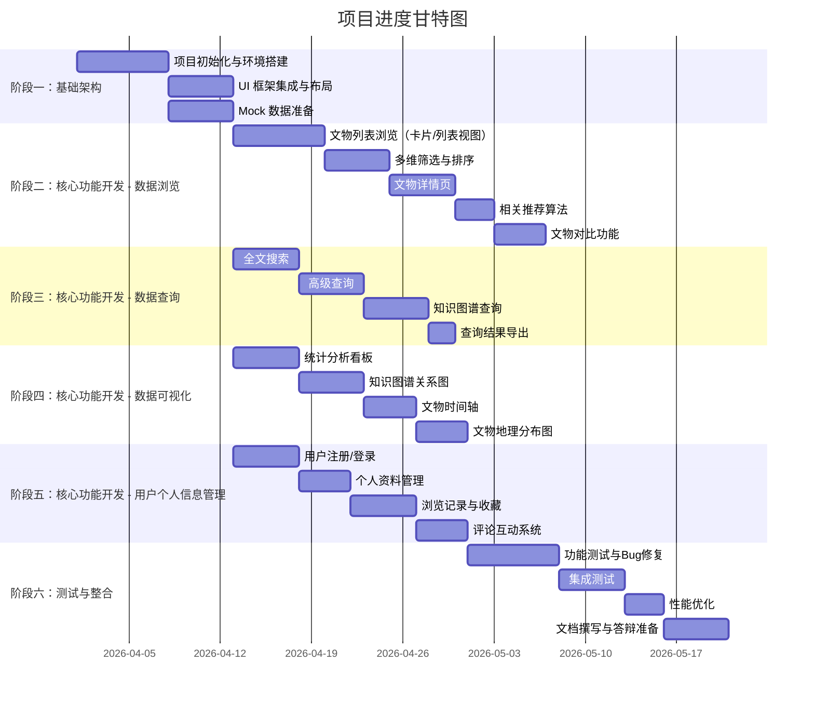

# 海外文物知识服务子系统 - 项目管理计划

---

## 文档版本记录

| 版本 | 日期 | 作者 | 变更说明 |
|------|------|------|----------|
| v1.0 | 2026-05-15 | 项目组 | 初稿 |

---

## 1. 项目概述

### 1.1 项目名称

海外文物知识服务子系统（Overseas Artifacts Knowledge Service Subsystem）

### 1.2 项目背景

本项目是"海外藏中国文物知识管理与服务平台"的第二个子系统。该平台以知识图谱技术为核心，整合数据爬取、知识建模、信息检索、可视化展示、智能问答等多项技术，涵盖 Web 端、移动端及后台管理系统的完整软件开发实践。

海外文物知识服务子系统作为平台面向用户的主要入口，负责提供 Web 端文物数据的浏览、查询、可视化与个性化服务。

### 1.3 项目目标

开发一个类似大英博物馆风格的 Web 端文物浏览系统，为用户提供以下核心能力：

- **数据浏览**：多维度、多形式的文物浏览体验（卡片/列表、筛选、排序、详情、对比）
- **数据查询**：从简单到复杂的多层次查询能力（全文搜索、高级查询、知识图谱查询）
- **数据可视化**：从多个维度对文物知识图谱进行可视化展示（知识图谱关系图、时间轴、地理分布图、统计分析看板）
- **用户个人信息管理**：用户注册登录、个人资料管理、浏览记录、收藏、评论互动

### 1.4 所属总体架构

```
海外藏中国文物知识管理与服务平台
├── 子系统1：知识图谱构建子系统（数据爬取与建模）
├── 子系统2：海外文物知识服务子系统（本项目）
├── 子系统3：知识问答子系统（智能问答）
├── 子系统4：掌上博物馆（移动端App）
├── 子系统5：后台管理子系统（统一管理）
```

---

## 2. 项目团队

### 2.1 团队成员与分工

| 角色 | 姓名 | 职责范围 | 核心任务 |
|------|------|----------|----------|
| **数据浏览** | 刘思益 | 数据浏览模块 | 文物列表/卡片视图、多维筛选、排序、详情页、相关推荐、文物对比 |
| **数据查询** | 郭展宏 | 数据查询模块 | 全文搜索、高级查询、知识图谱查询、查询结果导出 |
| **数据可视化** | 田亮 | 数据可视化模块 | 统计分析看板、知识图谱关系图、文物时间轴、文物地理分布图 |
| **用户个人信息管理** | 米嘉鹏 | 用户模块 | 用户注册/登录、个人资料、浏览记录、收藏功能、评论互动 |
| **测试整合** | 赵子皓 | 测试与集成 | 功能测试、集成测试、性能测试、部署发布、代码审查 |

### 2.2 沟通机制

- **日常沟通**：微信群实时沟通
- **周例会**：每周一次线下或线上同步会议
- **代码审查**：Pull Request 提交后由测试整合角色审查
- **文档共享**：GitHub Wiki 及项目文档目录

---

## 3. 技术栈

| 类别 | 技术 | 版本 | 用途 |
|------|------|------|------|
| 框架 | React | 18.x | UI 框架（函数式组件 + Hooks） |
| 语言 | TypeScript | 5.x | 类型安全（严格模式，零 any） |
| 构建工具 | Vite | 5.x | 构建与热更新 |
| CSS框架 | TailwindCSS | 3.x | 原子化 CSS |
| UI组件库 | shadcn/ui | latest | 基础组件库 |
| 路由 | React Router | 6.x | 客户端路由 |
| 状态管理 | Zustand | 4.x | 轻量级全局状态管理 |
| HTTP客户端 | Axios | 1.x | HTTP 请求（后期对接） |
| 图表 | ECharts | 5.x | 数据可视化图表 |
| 地图 | Leaflet | 1.x | 地理分布图 |
| 图标 | lucide-react | latest | 图标库 |
| 图标/数据 | Mock 数据 | — | 开发阶段使用 |

---

## 4. 进度计划

### 4.1 总体阶段划分



### 4.2 详细任务分解

#### 阶段一：基础架构搭建（负责人：刘思益、赵子皓）

| 任务编号 | 任务名称 | 工时 | 产出物 |
|----------|----------|------|--------|
| 1.1 | Vite + React + TS 项目初始化 | 1天 | 项目脚手架 |
| 1.2 | TailwindCSS + shadcn/ui 集成 | 1天 | UI 基础组件 |
| 1.3 | React Router 路由配置 | 1天 | 路由结构 |
| 1.4 | Zustand Store 基础架构 | 1天 | Store 骨架 |
| 1.5 | 布局组件开发（Header/Footer/Layout） | 2天 | 布局组件 |
| 1.6 | Mock 数据结构定义 | 1天 | 类型定义 |
| 1.7 | Mock 数据准备（文物、分类等） | 3天 | Mock 数据集 |
| 1.8 | 项目管理与规范文档 | 1天 | 文档 |

#### 阶段二：数据浏览模块（负责人：刘思益）

| 任务编号 | 任务名称 | 工时 | 产出物 |
|----------|----------|------|--------|
| 2.1 | ArtifactCard 卡片组件 | 2天 | 卡片组件 |
| 2.2 | ArtifactListItem 列表项组件 | 1天 | 列表组件 |
| 2.3 | FilterPanel 筛选面板组件 | 2天 | 筛选面板 |
| 2.4 | SortControl 排序控制组件 | 1天 | 排序控件 |
| 2.5 | BrowsePage 浏览页集成 | 2天 | 浏览页 |
| 2.6 | DetailPage 详情页（含图片放大） | 3天 | 详情页 |
| 2.7 | 智能推荐算法实现 | 2天 | 推荐逻辑 |
| 2.8 | ComparePage 对比页面 | 2天 | 对比页 |

#### 阶段三：数据查询模块（负责人：郭展宏）

| 任务编号 | 任务名称 | 工时 | 产出物 |
|----------|----------|------|--------|
| 3.1 | SearchPage 全文搜索页 | 3天 | 搜索页 |
| 3.2 | AdvancedSearchPage 高级查询页 | 3天 | 高级查询页 |
| 3.3 | 知识图谱查询入口 | 2天 | 查询接口 |
| 3.4 | 查询结果导出（CSV/JSON） | 1天 | 导出功能 |

#### 阶段四：数据可视化模块（负责人：田亮）

| 任务编号 | 任务名称 | 工时 | 产出物 |
|----------|----------|------|--------|
| 4.1 | 统计分析看板（Statistics） | 3天 | 统计页 |
| 4.2 | 知识图谱关系图（KnowledgeGraph） | 3天 | 图谱页 |
| 4.3 | 文物时间轴（Timeline） | 2天 | 时间轴页 |
| 4.4 | 文物地理分布图（Map） | 2天 | 地图页 |

#### 阶段五：用户个人信息管理模块（负责人：米嘉鹏）

| 任务编号 | 任务名称 | 工时 | 产出物 |
|----------|----------|------|--------|
| 5.1 | 用户注册/登录页面 | 3天 | 登录/注册页 |
| 5.2 | 用户认证逻辑与状态管理 | 2天 | Auth 逻辑 |
| 5.3 | ProfilePage 个人资料页 | 2天 | 个人资料页 |
| 5.4 | 浏览记录功能 | 1天 | 历史记录 |
| 5.5 | 收藏功能（分组管理） | 2天 | 收藏页 |
| 5.6 | 评论互动系统 | 2天 | 评论功能 |

#### 阶段六：测试与整合（负责人：赵子皓）

| 任务编号 | 任务名称 | 工时 | 产出物 |
|----------|----------|------|--------|
| 6.1 | 功能完整性测试 | 2天 | 测试报告 |
| 6.2 | 跨模块集成测试 | 2天 | 集成测试 |
| 6.3 | UI/UX 走查与修复 | 2天 | 优化结果 |
| 6.4 | 性能优化 | 1天 | 优化结果 |
| 6.5 | 代码审查与规范检查 | 1天 | 审查报告 |
| 6.6 | 文档完善（需求/设计/计划） | 3天 | 完整文档 |

### 4.3 关键里程碑

| 里程碑 | 时间 | 交付物 |
|--------|------|--------|
| M1：项目启动 | 2026-04-01 | 项目初始化完成 |
| M2：基础架构完成 | 2026-04-12 | 可运行的项目框架 |
| M3：数据浏览完成 | 2026-04-26 | 浏览、筛选、排序、详情、对比 |
| M4：数据查询完成 | 2026-04-26 | 搜索、高级查询、图谱查询 |
| M5：数据可视化完成 | 2026-04-26 | 统计、图谱、时间轴、地图 |
| M6：用户管理完成 | 2026-04-26 | 登录、注册、收藏、评论 |
| M7：测试整合完成 | 2026-05-05 | 完整可演示系统 |
| M8：答辩准备 | 2026-05-15 | 全部文档 + 演示 |

---

## 5. 风险管理

### 5.1 风险识别

| 风险编号 | 风险描述 | 概率 | 影响 | 等级 | 应对策略 |
|----------|----------|------|------|------|----------|
| R1 | 知识图谱子系统数据未就绪 | 中 | 高 | 高 | 使用 Mock 数据独立开发，预留 API 接口 |
| R2 | 团队成员经验不足（React/TS） | 高 | 中 | 高 | 编写 AGENTS.md 规范文档，代码审查机制 |
| R3 | 页面加载性能不达标 | 低 | 中 | 中 | 骨架屏、懒加载、虚拟滚动预留 |
| R4 | 浏览器兼容性问题 | 低 | 低 | 低 | 使用标准 Web API，避免私有特性 |
| R5 | 项目进度延期 | 中 | 高 | 高 | 甘特图跟踪，每周同步进度 |

### 5.2 风险缓解措施

- **R1 应对**：开发阶段全部使用 Mock 数据，artifactService 层抽象 IArtifactService 接口，后期只需替换实现
- **R2 应对**：AGENTS.md 规范文档提供了完整的代码示例和约束，通过 PR 审查保证代码质量
- **R5 应对**：功能性按优先级划分为 P0/P1/P2，确保核心功能优先完成

---

## 6. 质量保证

### 6.1 代码质量标准

- TypeScript 严格模式，零 `any` 类型
- 函数式组件 + Hooks（禁止 class 组件）
- TailwindCSS 原子类名（禁止内联 style）
- 使用 shadcn/ui 组件库（禁止引入其他 UI 库）
- PascalCase 命名（组件文件），camelCase 命名（工具函数/Hook/Store）

### 6.2 测试策略

| 测试类型 | 范围 | 工具 | 负责人 |
|----------|------|------|--------|
| 手动功能测试 | 全部页面路由 | 浏览器 DevTools | 赵子皓 |
| 集成测试 | 跨模块数据流 | 手动测试 | 赵子皓 |
| 响应式测试 | 多设备/分辨率 | Chrome DevTools | 赵子皓 |
| TypeScript 类型检查 | 全部源代码 | `npm run typecheck` | 全员 |

### 6.3 验收标准

1. ✅ 所有页面路由可正常访问
2. ✅ 筛选、排序、搜索功能正确
3. ✅ 详情页信息完整展示
4. ✅ 对比功能可正常使用
5. ✅ 可视化图表正确渲染
6. ✅ 用户注册/登录流程完整
7. ✅ 收藏、评论功能正常
8. ✅ TypeScript 类型检查通过
9. ✅ 生产构建成功（`npm run build`）
10. ✅ 响应式布局适配良好

---

## 7. 交付物清单

### 7.1 代码交付物

```
knowledge-service-web-main/
├── src/
│   ├── components/        # UI 组件
│   ├── pages/             # 页面组件
│   ├── store/             # 状态管理
│   ├── services/          # 服务层
│   ├── mock/              # Mock 数据
│   ├── types/             # 类型定义
│   └── lib/               # 工具库
├── docs/
│   └── tech-design.md     # 技术设计文档
├── AGENTS.md              # 开发规范
├── README.md              # 项目说明
├── package.json           # 依赖配置
└── vite.config.ts         # Vite 配置
```

### 7.2 文档交付物

| 文档 | 说明 | 负责人 |
|------|------|--------|
| 项目管理计划 | 本文件，含进度、分工、风险管理 | 项目组 |
| 需求规格说明书 | 系统功能需求与非功能需求 | 项目组 |
| 设计报告 | 系统架构设计与技术选型 | 项目组 |
| 测试报告 | 功能测试、集成测试结果 | 赵子皓 |
| 用户手册 | 系统使用说明 | 项目组 |

### 7.3 部署交付物

- 生产构建产物：`dist/` 目录
- 可选部署平台：Vercel / Netlify / GitHub Pages

---

## 8. 资源管理

### 8.1 开发环境

| 资源 | 说明 |
|------|------|
| 代码仓库 | GitHub |
| 开发工具 | VS Code |
| 运行环境 | Node.js 16+ / npm 8+ |
| 浏览器 | Chrome / Edge / Firefox |

### 8.2 参考资料

- 大英博物馆官网（UI/UX 设计参考）
- shadcn/ui 官方文档
- TailwindCSS 官方文档
- ECharts 官方示例库
- Leaflet 地图库文档

---

## 9. 变更管理

### 9.1 变更流程

```
提出变更 → 团队讨论 → 评估影响 → 批准/拒绝 → 更新计划 → 执行变更
```

### 9.2 变更记录

| 变更编号 | 日期 | 描述 | 影响范围 | 审批人 |
|----------|------|------|----------|--------|
| — | — | — | — | — |

---

## 10. 附录

### 10.1 缩写说明

| 缩写 | 全称 |
|------|------|
| SPA | Single Page Application（单页应用） |
| SRS | Software Requirements Specification（需求规格说明书） |
| UI | User Interface（用户界面） |
| UX | User Experience（用户体验） |
| HMR | Hot Module Replacement（热模块替换） |
| API | Application Programming Interface（应用程序编程接口） |

### 10.2 相关文档

- [课程设计题目文档](../1.课程设计题目-海外藏中国文物知识管理与服务平台.docx)
- [需求规格说明书](./需求规格说明书.md)
- [设计报告](./设计报告.md)
- [开发规范文档](../AGENTS.md)

---


